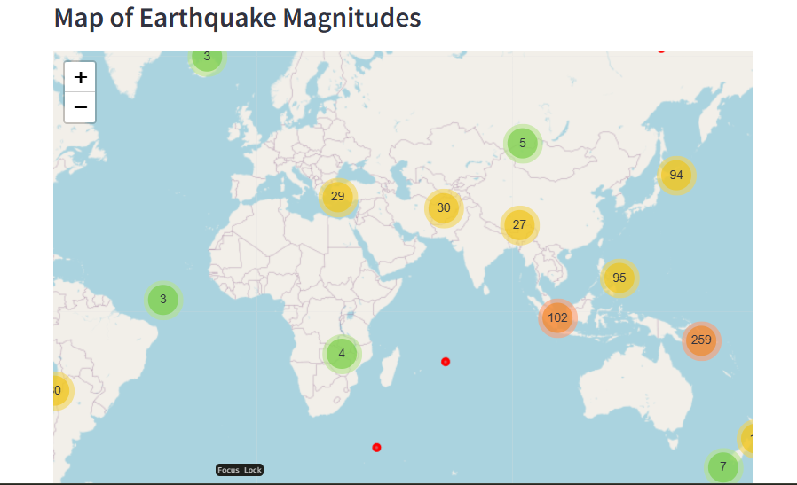
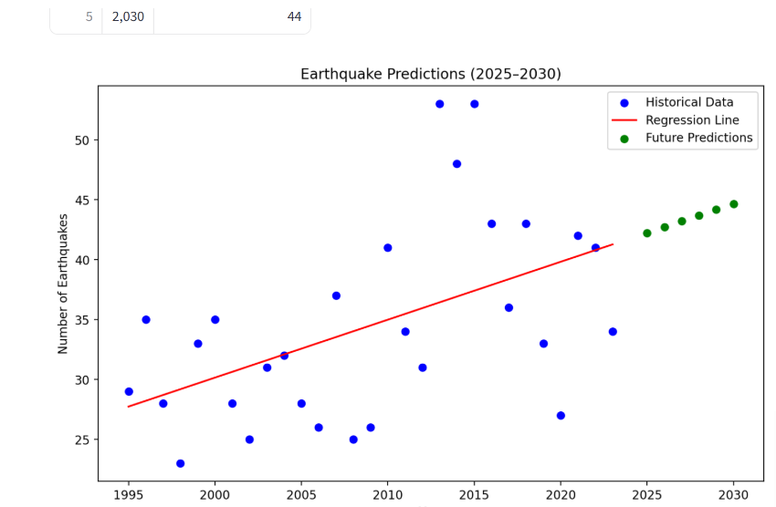
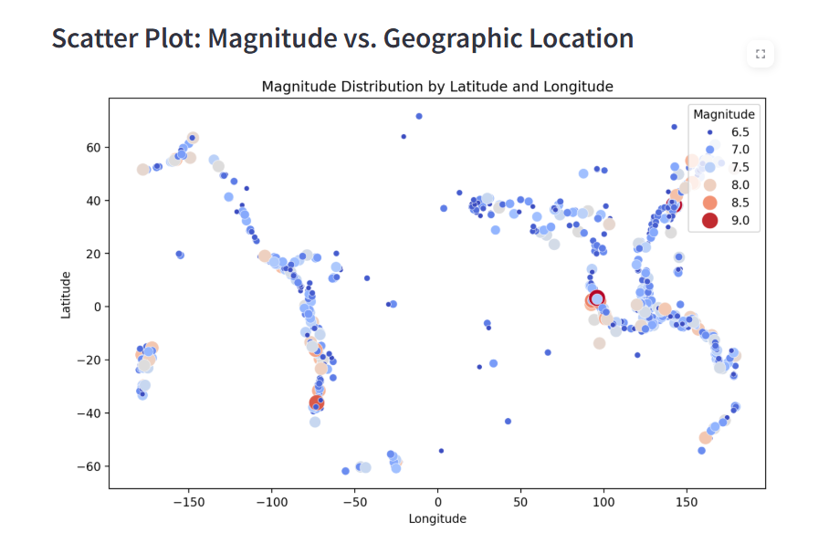

# Earthquake Data Analysis and Visualization (1995 - 2023)

Explore and visualize earthquake data from 1995 to 2023 through this interactive Streamlit app. This application allows users to analyze global earthquake characteristics such as magnitude, depth, frequency, and geographic distribution. It also visualizes potential relationships between earthquake attributes and tsunami occurrences.

[](https://da-multi-pr.streamlit.app/)

## Project Overview
This project provides an interactive platform for exploring earthquake data across continents and time. It includes various visualizations to help users understand trends and identify key patterns, such as depth and magnitude’s influence on tsunami probability. This tool is built using Streamlit, pandas, matplotlib, and folium.

### Files
- **`earthquake_1995-2023.csv`**: A CSV file with earthquake data, containing columns for magnitude, depth, date, geographic coordinates, continent, and tsunami occurrence.
- **`streamlit_app.py`**: The main Streamlit app script that handles data processing, filtering, and visualization.

### Key Features
#### 1. Interactive Earthquake Distribution Map
   - **Purpose**: Allows users to view earthquakes in specific continents and years, highlighting regional earthquake activity and distribution.
   - **Filters**: Continent and year (with options for “All Continents” and “All Years”).
   - **Visualization**: Earthquakes are color-coded by magnitude, with an intuitive legend for reference.
   - **Library**: Built with `folium` for interactive map functionality.

#### 2. Earthquake Trend by Year
   - **Purpose**: Visualizes earthquake trends over time, helping users analyze patterns in earthquake frequency from year to year.
   - **Table**: Shows earthquake counts per year in a clean horizontal format.
   - **Library**: Uses `matplotlib` for the trend line plot and `pandas` for data handling.

#### 3. Tsunami Occurrence by Depth and Magnitude
   - **Purpose**: Examines how earthquake depth and magnitude relate to tsunami events.
   - **Visualization**: A scatter plot where earthquakes associated with tsunamis are marked in red, and others in blue.
   - **Library**: Created with `matplotlib`.

## How to Run the Application
To run the Streamlit app locally, follow these steps:

1. **Install Dependencies**:
    ```bash
    pip install -r requirements.txt
    ```

2. **Start the Application**:
    ```bash
    streamlit run streamlit_app.py
    ```

3. **Access the App**: Open the displayed link in your console (usually [http://localhost:8501](http://localhost:8501)) to interact with the app in your browser.

## Code Structure
- **Data Loading and Processing**: Earthquake data is loaded from the CSV file with `pandas`, and dates are parsed to add a ‘year’ column for easy filtering.
- **Filtering**: Filters for continent and year are applied within Streamlit, offering a straightforward, user-friendly interface.
- **Visualizations**:
   - **Map**: An interactive map with `folium` for viewing earthquake locations by region and year.
   - **Charts**: Trend lines and scatter plots with `matplotlib` to analyze trends and tsunami relationships.

## Visualization Examples
The application includes the following visualization tools:

1. **Earthquake Distribution Map**: Shows earthquakes by continent and year, with color-coded markers based on magnitude.
   
3. **Trend Line (Earthquake Count)**: Displays the number of earthquakes over the years along with a table of yearly earthquake counts. 
4. **Scatter Plot (Tsunami Probability)**: Illustrates the correlation between earthquake depth, magnitude, and tsunami likelihood.

## Future Enhancements
In future versions, we aim to add:
- **Additional Filters**: Filtering options based on magnitude, depth, and specific regions.
- **Tsunami Probability Forecasting**: Forecasting models based on depth and magnitude to predict tsunami potential.
- **Export Functionality**: Options to export graphs and tables as image or CSV files for offline analysis.

## Conclusion
This Earthquake Data Analysis app provides a powerful tool for visualizing and exploring global earthquake data, fostering insights into their distribution, yearly trends, and factors influencing tsunami occurrences. We hope this platform offers valuable perspectives for both educational and research purposes in seismology and disaster preparedness.
